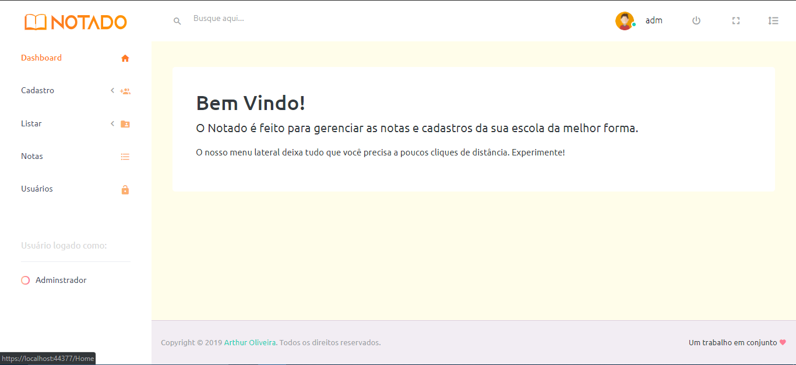

# NOTADO

> Projeto criado durante meu aprendizado de .NET. Consiste em um CRUD de alunos, professores, notas e faltas para uma escola.

### Ajustes e melhorias

Paralisei o projeto em 2019 e pretendo refatorá-lo com as novas tecnologias nas quais adquiri conhecimento

Esse projeto está sob licença. Veja o arquivo [LICENÇA](LICENSE.md) para mais detalhes.

[⬆ Voltar ao topo](#NOTADO) 
